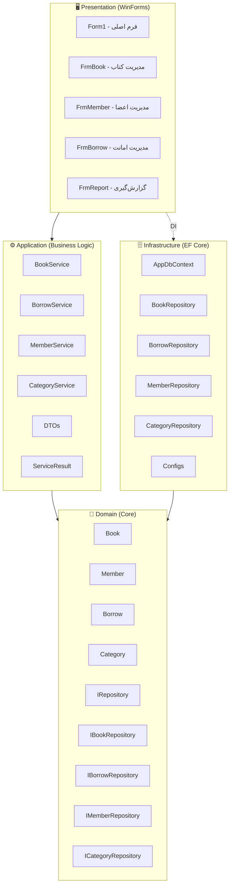

# 📚 AllameDehkhoda Library Management System

سیستم مدیریت کتابخانه با معماری Clean Architecture

---

## 🏗️ معماری پروژه



---

## 📁 ساختار پوشه‌ها

```
AllameDehkhoda/
│   AllameDehkhoda.slnx
│
├── AllameDehkhoda.Domain          # هسته اصلی
│   ├── Entities/
│   │   ├── BaseEntity.cs
│   │   ├── Book.cs
│   │   ├── Borrow.cs
│   │   ├── Category.cs
│   │   └── Member.cs
│   └── Interfaces/
│       ├── IRepository.cs
│       ├── IBookRepository.cs
│       ├── IBorrowRepository.cs
│       ├── ICategoryRepository.cs
│       └── IMemberRepository.cs
│
├── AllameDehkhoda.Application     # منطق کسب‌وکار
│   ├── DTO/
│   ├── Interfaces/
│   ├── Services/
│   └── Common/
│       └── ServiceResult.cs
│
├── AllameDehkhoda.Infrastructure  # EF Core
│   ├── Data/
│   │   ├── AppDbContext.cs
│   │   └── AppDbContextFactory.cs
│   ├── Configs/
│   ├── Repository/
│   └── Migrations/
│
└── AllameDehkhoda.Presentation    # WinForms UI
    ├── Program.cs
    ├── Form1.cs
    ├── FrmBook.cs
    ├── FrmMember.cs
    ├── FrmBorrow.cs
    ├── FrmReport.cs
    └── Common/
        ├── DateTimeFuncs.cs
        ├── SaveAsXML.cs
        └── UIHelper.cs
```

---

## 🛠️ تکنولوژی‌ها

| بخش | تکنولوژی |
|-----|-----------|
| زبان | C# / .NET |
| UI | WinForms |
| ORM | Entity Framework Core |
| معماری | Clean Architecture |
| دیتابیس | SQL Server |

---

## 🚀 راه‌اندازی

```bash
# کلون پروژه
git clone https://github.com/YOUR_USERNAME/AllameDehkhoda.git

# اجرای Migration
dotnet ef database update --project AllameDehkhoda.Infrastructure
```
